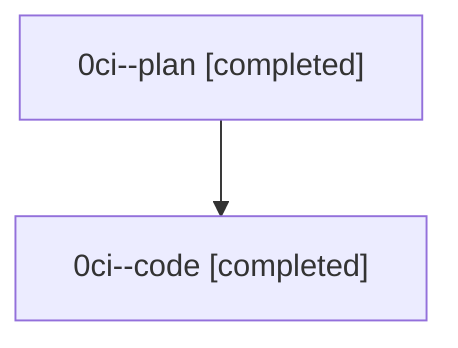

# Family: 0ci

[Agent Hoods](../README.md) / [bbugyi200](../users/bbugyi200/README.md) / [athena](../users/bbugyi200/machines/athena/README.md) / [0ci](../users/bbugyi200/machines/athena/hoods/0ci/README.md) / 0ci

Owner: `bbugyi200.athena` · Hood: `0ci` · Members: 2

## Lineage

The diagram is an optional enhancement; the ordered table below contains the same lineage in accessible text.

| Role | Agent | State | Model / provider | Timing | Commits | Prompt | Chat |
|---|---|---|---|---|---:|---|---|
| plan | 0ci--plan | completed | opus / claude | 2026-08-24T15:20:09.114982+00:00 → 2026-08-24T15:59:18.989686+00:00 | 0 | [Prompt](../agents/bbugyi200.athena.0ci--plan/prompt.md) | [Chat](../agents/bbugyi200.athena.0ci--plan/chat.md) |
| code | 0ci--code | completed | sonnet / claude | 2026-08-24T15:37:21.048195+00:00 → 2026-08-24T15:59:18.989686+00:00 | [1](../agents/bbugyi200.athena.0ci--code/README.md#commits) | — | [Chat](../agents/bbugyi200.athena.0ci--code/chat.md) |

## Commits

| Role | Repo | Commit | Subject | Committed |
|---|---|---|---|---|
| code | sase | [`0eb0730`](https://github.com/sase-org/sase/commit/0eb073079d2fcc63a0c0ec501364ef99ad770551) | feat(xprompt): reference approved plans by path in #coder instead of inlining | 2026-08-24 11:56:25 EDT |
