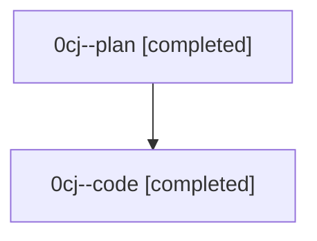

# Family: 0cj

[Agent Hoods](../README.md) / [bbugyi200](../users/bbugyi200/README.md) / [athena](../users/bbugyi200/machines/athena/README.md) / [0cj](../users/bbugyi200/machines/athena/hoods/0cj/README.md) / 0cj

Owner: `bbugyi200.athena` · Hood: `0cj` · Members: 2

## Lineage

The diagram is an optional enhancement; the ordered table below contains the same lineage in accessible text.

| Role | Agent | State | Model / provider | Timing | Commits | Prompt | Chat |
|---|---|---|---|---|---:|---|---|
| plan | 0cj--plan | completed | gpt-5.6-sol / codex | 2026-08-24T15:24:09.151045+00:00 → 2026-08-24T16:24:40.348754+00:00 | 0 | [Prompt](../agents/bbugyi200.athena.0cj--plan/prompt.md) | [Chat](../agents/bbugyi200.athena.0cj--plan/chat.md) |
| code | 0cj--code | completed | sonnet / claude | 2026-08-24T15:35:59.944041+00:00 → 2026-08-24T16:24:40.348754+00:00 | [1](../agents/bbugyi200.athena.0cj--code/README.md#commits) | — | [Chat](../agents/bbugyi200.athena.0cj--code/chat.md) |

## Commits

| Role | Repo | Commit | Subject | Committed |
|---|---|---|---|---|
| code | sase | [`aeae0bb`](https://github.com/sase-org/sase/commit/aeae0bb8f6e63b35b3c31a68f2a0140dd1b14a35) | feat(agent): thread base\_env through standalone proc launch runtime | 2026-08-24 12:23:43 EDT |
