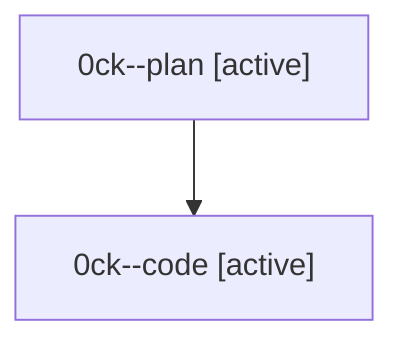

# Family: 0ck

[Agent Hoods](../README.md) / [bbugyi200](../users/bbugyi200/README.md) / [athena](../users/bbugyi200/machines/athena/README.md) / [0ck](../users/bbugyi200/machines/athena/hoods/0ck/README.md) / 0ck

Owner: `bbugyi200.athena` · Hood: `0ck` · Members: 2

## Lineage

The diagram is an optional enhancement; the ordered table below contains the same lineage in accessible text.

| Role | Agent | State | Model / provider | Timing | Commits | Prompt | Chat |
|---|---|---|---|---|---:|---|---|
| plan | 0ck--plan | active | opus / claude | 2026-08-24T16:12:05.352640+00:00 | 0 | [Prompt](../agents/bbugyi200.athena.0ck--plan/prompt.md) | [Chat](../agents/bbugyi200.athena.0ck--plan/chat.md) |
| code | 0ck--code | active | gpt-5.5 / codex | 2026-08-24T16:29:40.575015+00:00 | 0 | — | — |
