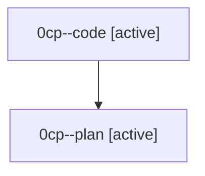

# Family: 0cp

[Agent Hoods](../README.md) / [bbugyi200](../users/bbugyi200/README.md) / [athena](../users/bbugyi200/machines/athena/README.md) / [0cp](../users/bbugyi200/machines/athena/hoods/0cp/README.md) / 0cp

Owner: `bbugyi200.athena` · Hood: `0cp` · Members: 2

## Lineage

The diagram is an optional enhancement; the ordered table below contains the same lineage in accessible text.

| Role | Agent | State | Model / provider | Timing | Commits | Prompt | Chat |
|---|---|---|---|---|---:|---|---|
| code | 0cp--code | active | gpt-5.5 / codex | 2026-08-24T17:15:52.295645+00:00 | [1](../agents/bbugyi200.athena.0cp--code/README.md#commits) | — | — |
| plan | 0cp--plan | active | gpt-5.6-sol / codex | 2026-08-24T17:07:42.151258+00:00 | 0 | [Prompt](../agents/bbugyi200.athena.0cp--plan/prompt.md) | [Chat](../agents/bbugyi200.athena.0cp--plan/chat.md) |

## Commits

| Role | Repo | Commit | Subject | Committed |
|---|---|---|---|---|
| code | sase | [`2a13976`](https://github.com/sase-org/sase/commit/2a139761e1494703bb087444e219a3f56d829614) | fix(agent): suppress clean proc admission notifications | 2026-08-24 13:42:44 EDT |
