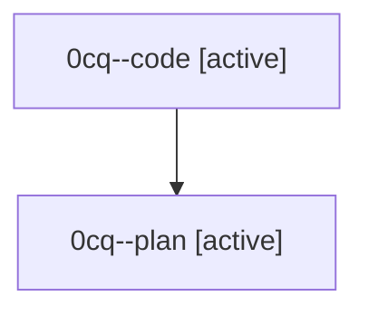

# Family: 0cq

[Agent Hoods](../README.md) / [bbugyi200](../users/bbugyi200/README.md) / [athena](../users/bbugyi200/machines/athena/README.md) / [0cq](../users/bbugyi200/machines/athena/hoods/0cq/README.md) / 0cq

Owner: `bbugyi200.athena` · Hood: `0cq` · Members: 2

## Lineage

The diagram is an optional enhancement; the ordered table below contains the same lineage in accessible text.

| Role | Agent | State | Model / provider | Timing | Commits | Prompt | Chat |
|---|---|---|---|---|---:|---|---|
| code | 0cq--code | active | gpt-5.5 / codex | 2026-08-24T17:54:58.564952+00:00 | [1](../agents/bbugyi200.athena.0cq--code/README.md#commits) | — | — |
| plan | 0cq--plan | active | gpt-5.6-sol / codex | 2026-08-24T17:44:22.899579+00:00 | 0 | [Prompt](../agents/bbugyi200.athena.0cq--plan/prompt.md) | [Chat](../agents/bbugyi200.athena.0cq--plan/chat.md) |

## Commits

| Role | Repo | Commit | Subject | Committed |
|---|---|---|---|---|
| code | sase | [`e500f0a`](https://github.com/sase-org/sase/commit/e500f0a71ebff2650c8dd4b49e2bdcdd464b5daa) | feat(ace): add pane-local artifact query history | 2026-08-24 15:07:23 EDT |
