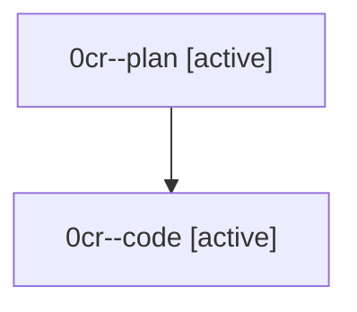

# Family: 0cr

[Agent Hoods](../README.md) / [bbugyi200](../users/bbugyi200/README.md) / [athena](../users/bbugyi200/machines/athena/README.md) / [0cr](../users/bbugyi200/machines/athena/hoods/0cr/README.md) / 0cr

Owner: `bbugyi200.athena` · Hood: `0cr` · Members: 2

## Lineage

The diagram is an optional enhancement; the ordered table below contains the same lineage in accessible text.

| Role | Agent | State | Model / provider | Timing | Commits | Prompt | Chat |
|---|---|---|---|---|---:|---|---|
| plan | 0cr--plan | active | opus / claude | 2026-08-24T17:55:01.150098+00:00 | 0 | [Prompt](../agents/bbugyi200.athena.0cr--plan/prompt.md) | [Chat](../agents/bbugyi200.athena.0cr--plan/chat.md) |
| code | 0cr--code | active | sonnet / claude | 2026-08-24T18:07:07.718006+00:00 | [1](../agents/bbugyi200.athena.0cr--code/README.md#commits) | — | — |

## Commits

| Role | Repo | Commit | Subject | Committed |
|---|---|---|---|---|
| code | sase | [`43f4538`](https://github.com/sase-org/sase/commit/43f4538f885e982a082119f5597a63b21b0e98da) | feat(finalizers): seal config snapshot into authority artifact and report live drift as diagnostics | 2026-08-24 14:36:04 EDT |
