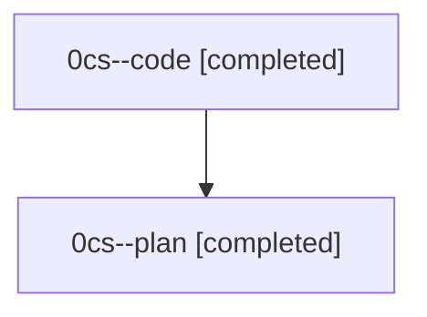

# Family: 0cs

[Agent Hoods](../README.md) / [bbugyi200](../users/bbugyi200/README.md) / [athena](../users/bbugyi200/machines/athena/README.md) / [0cs](../users/bbugyi200/machines/athena/hoods/0cs/README.md) / 0cs

Owner: `bbugyi200.athena` · Hood: `0cs` · Members: 2

## Lineage

The diagram is an optional enhancement; the ordered table below contains the same lineage in accessible text.

| Role | Agent | State | Model / provider | Timing | Commits | Prompt | Chat |
|---|---|---|---|---|---:|---|---|
| code | 0cs--code | completed | gpt-5.5 / codex | 2026-08-24T18:07:23.224866+00:00 → 2026-08-24T18:37:14.836305+00:00 | [1](../agents/bbugyi200.athena.0cs--code/README.md#commits) | — | [Chat](../agents/bbugyi200.athena.0cs--code/chat.md) |
| plan | 0cs--plan | completed | gpt-5.6-sol / codex | 2026-08-24T17:58:20.765830+00:00 → 2026-08-24T18:37:14.836305+00:00 | 0 | [Prompt](../agents/bbugyi200.athena.0cs--plan/prompt.md) | [Chat](../agents/bbugyi200.athena.0cs--plan/chat.md) |

## Commits

| Role | Repo | Commit | Subject | Committed |
|---|---|---|---|---|
| code | sase | [`d88994b`](https://github.com/sase-org/sase/commit/d88994bd816dcc61447a068ea4844b3b176b8382) | fix(axe): preserve chop dispatch project routing | 2026-08-24 14:36:39 EDT |
