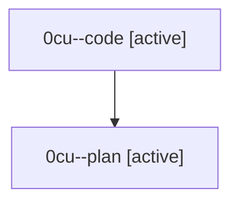

# Family: 0cu

[Agent Hoods](../README.md) / [bbugyi200](../users/bbugyi200/README.md) / [athena](../users/bbugyi200/machines/athena/README.md) / [0cu](../users/bbugyi200/machines/athena/hoods/0cu/README.md) / 0cu

Owner: `bbugyi200.athena` · Hood: `0cu` · Members: 2

## Lineage

The diagram is an optional enhancement; the ordered table below contains the same lineage in accessible text.

| Role | Agent | State | Model / provider | Timing | Commits | Prompt | Chat |
|---|---|---|---|---|---:|---|---|
| code | 0cu--code | active | sonnet / claude | 2026-08-24T18:38:26.742625+00:00 | 0 | — | — |
| plan | 0cu--plan | active | gpt-5.6-sol / codex | 2026-08-24T18:33:09.529331+00:00 | 0 | [Prompt](../agents/bbugyi200.athena.0cu--plan/prompt.md) | [Chat](../agents/bbugyi200.athena.0cu--plan/chat.md) |
