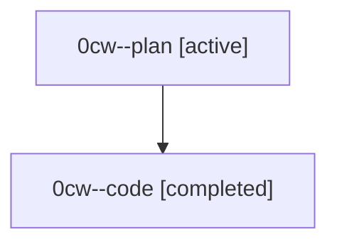

# Family: 0cw

[Agent Hoods](../README.md) / [bbugyi200](../users/bbugyi200/README.md) / [athena](../users/bbugyi200/machines/athena/README.md) / [0cw](../users/bbugyi200/machines/athena/hoods/0cw/README.md) / 0cw

Owner: `bbugyi200.athena` · Hood: `0cw` · Members: 2

## Lineage

The diagram is an optional enhancement; the ordered table below contains the same lineage in accessible text.

| Role | Agent | State | Model / provider | Timing | Commits | Prompt | Chat |
|---|---|---|---|---|---:|---|---|
| plan | 0cw--plan | active | gpt-5.6-sol / codex | 2026-08-24T18:48:41.845071+00:00 | 0 | [Prompt](../agents/bbugyi200.athena.0cw--plan/prompt.md) | [Chat](../agents/bbugyi200.athena.0cw--plan/chat.md) |
| code | 0cw--code | completed | gpt-5.5 / codex | 2026-08-24T18:54:46.528671+00:00 → 2026-08-24T19:15:55.108601+00:00 | [1](../agents/bbugyi200.athena.0cw--code/README.md#commits) | — | [Chat](../agents/bbugyi200.athena.0cw--code/chat.md) |

## Commits

| Role | Repo | Commit | Subject | Committed |
|---|---|---|---|---|
| code | sase | [`04299c2`](https://github.com/sase-org/sase/commit/04299c29e7d73cbdb43cb66cf3946521e4873bbc) | fix: advance agent marks to folded banners | 2026-08-24 15:14:41 EDT |
