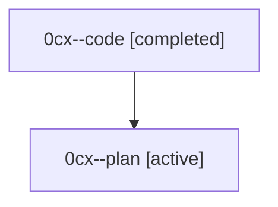

# Family: 0cx

[Agent Hoods](../README.md) / [bbugyi200](../users/bbugyi200/README.md) / [athena](../users/bbugyi200/machines/athena/README.md) / [0cx](../users/bbugyi200/machines/athena/hoods/0cx/README.md) / 0cx

Owner: `bbugyi200.athena` · Hood: `0cx` · Members: 2

## Lineage

The diagram is an optional enhancement; the ordered table below contains the same lineage in accessible text.

| Role | Agent | State | Model / provider | Timing | Commits | Prompt | Chat |
|---|---|---|---|---|---:|---|---|
| code | 0cx--code | completed | gpt-5.5 / codex | 2026-08-24T21:21:39.224045+00:00 → 2026-08-24T22:59:06.708374+00:00 | 0 | — | [Chat](../agents/bbugyi200.athena.0cx--code/chat.md) |
| plan | 0cx--plan | active | opus / claude | 2026-08-24T21:08:58.584481+00:00 | 0 | [Prompt](../agents/bbugyi200.athena.0cx--plan/prompt.md) | [Chat](../agents/bbugyi200.athena.0cx--plan/chat.md) |

## Commits

| Role | Repo | Commit | Subject | Committed |
|---|---|---|---|---|
| — | sase | [`c09fe51`](https://github.com/sase-org/sase/commit/c09fe5170800136c60ead1934062d1f15fc6dd9e) | feat(memory): support core memory priority | 2026-08-24 18:34:21 EDT |
