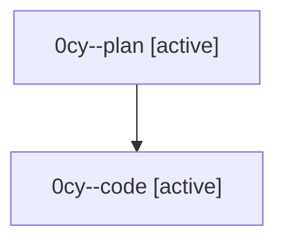

# Family: 0cy

[Agent Hoods](../README.md) / [bbugyi200](../users/bbugyi200/README.md) / [athena](../users/bbugyi200/machines/athena/README.md) / [0cy](../users/bbugyi200/machines/athena/hoods/0cy/README.md) / 0cy

Owner: `bbugyi200.athena` · Hood: `0cy` · Members: 2

## Lineage

The diagram is an optional enhancement; the ordered table below contains the same lineage in accessible text.

| Role | Agent | State | Model / provider | Timing | Commits | Prompt | Chat |
|---|---|---|---|---|---:|---|---|
| plan | 0cy--plan | active | gpt-5.6-sol / codex | 2026-08-24T21:16:18.715063+00:00 | 0 | [Prompt](../agents/bbugyi200.athena.0cy--plan/prompt.md) | [Chat](../agents/bbugyi200.athena.0cy--plan/chat.md) |
| code | 0cy--code | active | sonnet / claude | 2026-08-24T21:27:55.361672+00:00 | [1](../agents/bbugyi200.athena.0cy--code/README.md#commits) | — | — |

## Commits

| Role | Repo | Commit | Subject | Committed |
|---|---|---|---|---|
| code | sase | [`9abe196`](https://github.com/sase-org/sase/commit/9abe1967b916f1cdfa9c13a2be483c8cca98bc76) | test(bead): add regression test for legacy JSONL event-stream prefix preservation | 2026-08-24 17:58:58 EDT |
