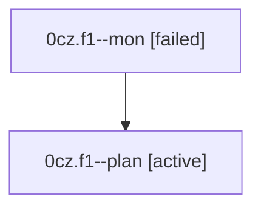

# Family: 0cz.f1

[Agent Hoods](../README.md) / [bbugyi200](../users/bbugyi200/README.md) / [athena](../users/bbugyi200/machines/athena/README.md) / [0cz](../users/bbugyi200/machines/athena/hoods/0cz/README.md) / 0cz.f1

Owner: `bbugyi200.athena` · Hood: `0cz` · Members: 2

## Lineage

The diagram is an optional enhancement; the ordered table below contains the same lineage in accessible text.

| Role | Agent | State | Model / provider | Timing | Commits | Prompt | Chat |
|---|---|---|---|---|---:|---|---|
| mon | 0cz.f1--mon | failed | gpt-5.6-sol / codex | 2026-08-24T22:28:11.673711+00:00 | 0 | — | [Chat](../agents/bbugyi200.athena.0cz.f1--mon/chat.md) |
| plan | 0cz.f1--plan | active | gpt-5.6-sol / codex | 2026-08-24T22:16:33.889646+00:00 | 0 | [Prompt](../agents/bbugyi200.athena.0cz.f1--plan/prompt.md) | [Chat](../agents/bbugyi200.athena.0cz.f1--plan/chat.md) |

## Neighbors

| Agent | Relation | State |
|---|---|---|
| [0cz](bbugyi200.athena.0cz.md) (family · 2) | ancestor | active 1, completed 1 |
