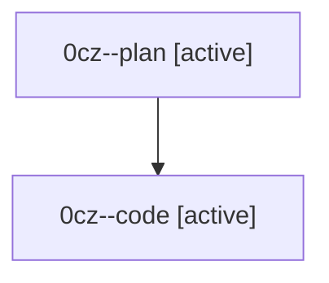

# Family: 0cz

[Agent Hoods](../README.md) / [bbugyi200](../users/bbugyi200/README.md) / [athena](../users/bbugyi200/machines/athena/README.md) / [0cz](../users/bbugyi200/machines/athena/hoods/0cz/README.md) / 0cz

Owner: `bbugyi200.athena` · Hood: `0cz` · Members: 2

## Lineage

The diagram is an optional enhancement; the ordered table below contains the same lineage in accessible text.

| Role | Agent | State | Model / provider | Timing | Commits | Prompt | Chat |
|---|---|---|---|---|---:|---|---|
| plan | 0cz--plan | active | opus / claude | 2026-08-24T21:19:02.677098+00:00 | 0 | [Prompt](../agents/bbugyi200.athena.0cz--plan/prompt.md) | [Chat](../agents/bbugyi200.athena.0cz--plan/chat.md) |
| code | 0cz--code | active | gpt-5.5 / codex | 2026-08-24T21:31:40.827350+00:00 | 0 | — | — |

## Neighbors

| Agent | Relation | State |
|---|---|---|
| [0cz.f0](../agents/bbugyi200.athena.0cz.f0/README.md) | descendant | waiting |
