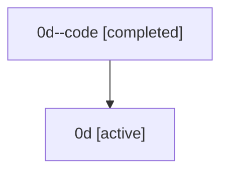

# Family: 0d

[Agent Hoods](../README.md) / [bbugyi200](../users/bbugyi200/README.md) / [athena](../users/bbugyi200/machines/athena/README.md) / [0d](../users/bbugyi200/machines/athena/hoods/0d/README.md) / 0d

Owner: `bbugyi200.athena` · Hood: `0d` · Members: 2

## Lineage

The diagram is an optional enhancement; the ordered table below contains the same lineage in accessible text.

| Role | Agent | State | Model / provider | Timing | Commits | Prompt | Chat |
|---|---|---|---|---|---:|---|---|
| code | 0d--code | completed | gpt-5.5 / codex | 2026-07-07T06:06:34.321523+00:00 | 0 | — | [Chat](../agents/bbugyi200.athena.0d--code/chat.md) |
| root | 0d | active | claude-fable-5 / claude | 2026-07-07T05:54:38.379472+00:00 | [4](../agents/bbugyi200.athena.0d/README.md#commits) | [Prompt](../agents/bbugyi200.athena.0d/prompt.md) | [Chat](../agents/bbugyi200.athena.0d/chat.md) |

## Commits

| Role | Repo | Commit | Subject | Committed (UTC) |
|---|---|---|---|---|
| root | sase | [`26767ec`](https://github.com/sase-org/sase/commit/26767ec70751d5374344a5dc4584d647cfdf7625) | chore: Add SDD prompt and plan for vim\_text\_area\_adoption | 2026-07-05 23:48:52 |
| root | sase | [`085054e`](https://github.com/sase-org/sase/commit/085054e325c5c32667f677eae30a2d04cf8771e6) | feat(tui): adopt vim text areas for modal inputs | 2026-07-06 00:49:46 |
| root | sase | [`5785c09`](https://github.com/sase-org/sase/commit/5785c092701161c4d272620deda1bf52a6a742c5) | chore: Add SDD prompt and plan for telegram\_project\_display\_names\_1 | 2026-07-07 06:06:33 |
| root | sase | [`0654041`](https://github.com/sase-org/sase/commit/0654041e20263c8b21b2666c5749ca6406dad333) | feat: humanize safe project filename stems | 2026-07-07 06:19:02 |
