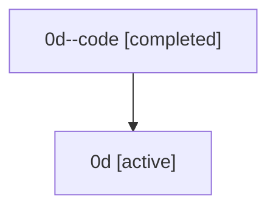

# Family: 0d

Owner: `bbugyi200.athena` · Hood: `0d` · Members: 2

## Lineage

The diagram is an optional enhancement; the ordered table below contains the same lineage in accessible text.

| Role | Agent | State | Model / provider | Timing | Commits | Prompt | Chat |
|---|---|---|---|---|---:|---|---|
| code | 0d--code | completed | gpt-5.5 / codex | 2026-07-07T06:06:34.321523+00:00 | 0 | — | [Chat](../agents/bbugyi200.athena.0d--code/chat.md) |
| root | 0d | active | claude-fable-5 / claude | 2026-07-07T05:54:38.379472+00:00 | 4 | [Prompt](../agents/bbugyi200.athena.0d/prompt.md) | [Chat](../agents/bbugyi200.athena.0d/chat.md) |
