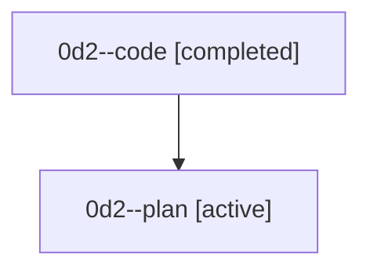

# Family: 0d2

[Agent Hoods](../README.md) / [bbugyi200](../users/bbugyi200/README.md) / [athena](../users/bbugyi200/machines/athena/README.md) / [0d2](../users/bbugyi200/machines/athena/hoods/0d2/README.md) / 0d2

Owner: `bbugyi200.athena` · Hood: `0d2` · Members: 2

## Lineage

The diagram is an optional enhancement; the ordered table below contains the same lineage in accessible text.

| Role | Agent | State | Model / provider | Timing | Commits | Prompt | Chat |
|---|---|---|---|---|---:|---|---|
| code | 0d2--code | completed | gpt-5.5 / codex | 2026-08-24T22:45:16.088043+00:00 → 2026-08-24T23:01:53.760148+00:00 | [1](../agents/bbugyi200.athena.0d2--code/README.md#commits) | — | [Chat](../agents/bbugyi200.athena.0d2--code/chat.md) |
| plan | 0d2--plan | active | gpt-5.6-sol / codex | 2026-08-24T22:26:32.240881+00:00 | 0 | [Prompt](../agents/bbugyi200.athena.0d2--plan/prompt.md) | [Chat](../agents/bbugyi200.athena.0d2--plan/chat.md) |

## Commits

| Role | Repo | Commit | Subject | Committed |
|---|---|---|---|---|
| code | sase | [`0f3f235`](https://github.com/sase-org/sase/commit/0f3f2350d77270935b9bc6142f39df61b50c9ecc) | fix(sdd): render parent plan provenance canonically | 2026-08-24 18:59:22 EDT |
