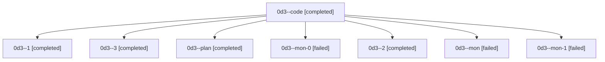

# Family: 0d3

[Agent Hoods](../README.md) / [bbugyi200](../users/bbugyi200/README.md) / [athena](../users/bbugyi200/machines/athena/README.md) / [0d3](../users/bbugyi200/machines/athena/hoods/0d3/README.md) / 0d3

Owner: `bbugyi200.athena` · Hood: `0d3` · Members: 8

## Lineage

The diagram is an optional enhancement; the ordered table below contains the same lineage in accessible text.

| Role | Agent | State | Model / provider | Timing | Commits | Prompt | Chat |
|---|---|---|---|---|---:|---|---|
| code | 0d3--code | completed | sonnet / claude | 2026-08-24T22:51:33.264704+00:00 → 2026-08-24T23:04:25.958406+00:00 | 0 | — | [Chat](../agents/bbugyi200.athena.0d3--code/chat.md) |
| 1 | 0d3--1 | completed | sonnet / claude | 2026-08-24T23:05:00.381525+00:00 → 2026-08-24T23:06:00.144496+00:00 | 0 | [Prompt](../agents/bbugyi200.athena.0d3--1/prompt.md) | [Chat](../agents/bbugyi200.athena.0d3--1/chat.md) |
| 3 | 0d3--3 | completed | sonnet / claude | 2026-08-24T23:19:25.165515+00:00 → 2026-08-24T23:21:39.876221+00:00 | [1](../agents/bbugyi200.athena.0d3--3/README.md#commits) | [Prompt](../agents/bbugyi200.athena.0d3--3/prompt.md) | [Chat](../agents/bbugyi200.athena.0d3--3/chat.md) |
| plan | 0d3--plan | completed | gpt-5.6-sol / codex | 2026-08-24T22:40:56.036587+00:00 → 2026-08-24T23:04:25.958406+00:00 | 0 | [Prompt](../agents/bbugyi200.athena.0d3--plan/prompt.md) | [Chat](../agents/bbugyi200.athena.0d3--plan/chat.md) |
| mon-0 | 0d3--mon-0 | failed | sonnet / claude | 2026-08-24T23:05:50.674720+00:00 | 0 | — | [Chat](../agents/bbugyi200.athena.0d3--mon-0/chat.md) |
| 2 | 0d3--2 | completed | sonnet / claude | 2026-08-24T23:10:44.562291+00:00 → 2026-08-24T23:17:49.806058+00:00 | 0 | [Prompt](../agents/bbugyi200.athena.0d3--2/prompt.md) | [Chat](../agents/bbugyi200.athena.0d3--2/chat.md) |
| mon | 0d3--mon | failed | sonnet / claude | 2026-08-24T23:04:14.563337+00:00 | 0 | — | [Chat](../agents/bbugyi200.athena.0d3--mon/chat.md) |
| mon-1 | 0d3--mon-1 | failed | sonnet / claude | 2026-08-24T23:17:39.937973+00:00 | 0 | — | [Chat](../agents/bbugyi200.athena.0d3--mon-1/chat.md) |

## Commits

| Role | Repo | Commit | Subject | Committed |
|---|---|---|---|---|
| 3 | sase | [`eb1aea8`](https://github.com/sase-org/sase/commit/eb1aea8af182c695fb84215ec9c8b121cbc754e2) | fix(axe): admit failed-fork parents into a real workspace instead of asserting | 2026-08-24 19:20:57 EDT |

## Neighbors

| Agent | Relation | State |
|---|---|---|
| [0d3.f0](../agents/bbugyi200.athena.0d3.f0/README.md) | descendant | completed |
