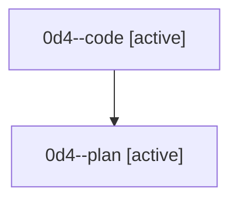

# Family: 0d4

[Agent Hoods](../README.md) / [bbugyi200](../users/bbugyi200/README.md) / [athena](../users/bbugyi200/machines/athena/README.md) / [0d4](../users/bbugyi200/machines/athena/hoods/0d4/README.md) / 0d4

Owner: `bbugyi200.athena` · Hood: `0d4` · Members: 2

## Lineage

The diagram is an optional enhancement; the ordered table below contains the same lineage in accessible text.

| Role | Agent | State | Model / provider | Timing | Commits | Prompt | Chat |
|---|---|---|---|---|---:|---|---|
| code | 0d4--code | active | sonnet / claude | 2026-08-24T23:08:24.141270+00:00 | [1](../agents/bbugyi200.athena.0d4--code/README.md#commits) | — | — |
| plan | 0d4--plan | active | opus / claude | 2026-08-24T22:55:27.055606+00:00 | 0 | [Prompt](../agents/bbugyi200.athena.0d4--plan/prompt.md) | [Chat](../agents/bbugyi200.athena.0d4--plan/chat.md) |

## Commits

| Role | Repo | Commit | Subject | Committed |
|---|---|---|---|---|
| code | sase | [`86bbbb5`](https://github.com/sase-org/sase/commit/86bbbb532096a532c61929695b91e9264c5800e9) | feat(ace): show clan-wide minimum remaining runtime on collapsed clan lanes | 2026-08-24 19:49:18 EDT |
