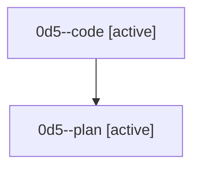

# Family: 0d5

[Agent Hoods](../README.md) / [bbugyi200](../users/bbugyi200/README.md) / [athena](../users/bbugyi200/machines/athena/README.md) / [0d5](../users/bbugyi200/machines/athena/hoods/0d5/README.md) / 0d5

Owner: `bbugyi200.athena` · Hood: `0d5` · Members: 2

## Lineage

The diagram is an optional enhancement; the ordered table below contains the same lineage in accessible text.

| Role | Agent | State | Model / provider | Timing | Commits | Prompt | Chat |
|---|---|---|---|---|---:|---|---|
| code | 0d5--code | active | gpt-5.5 / codex | 2026-08-24T23:21:30.493323+00:00 | [1](../agents/bbugyi200.athena.0d5--code/README.md#commits) | — | — |
| plan | 0d5--plan | active | gpt-5.6-sol / codex | 2026-08-24T23:11:28.732381+00:00 | 0 | [Prompt](../agents/bbugyi200.athena.0d5--plan/prompt.md) | [Chat](../agents/bbugyi200.athena.0d5--plan/chat.md) |

## Commits

| Role | Repo | Commit | Subject | Committed |
|---|---|---|---|---|
| code | sase | [`fdd76b5`](https://github.com/sase-org/sase/commit/fdd76b580a2cfe5dd36972540276de9158dd6f00) | fix(axe): restore typed chop wait chains | 2026-08-24 19:58:27 EDT |
