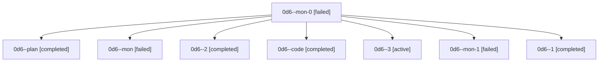

# Family: 0d6

[Agent Hoods](../README.md) / [bbugyi200](../users/bbugyi200/README.md) / [athena](../users/bbugyi200/machines/athena/README.md) / [0d6](../users/bbugyi200/machines/athena/hoods/0d6/README.md) / 0d6

Owner: `bbugyi200.athena` · Hood: `0d6` · Members: 8

## Lineage

The diagram is an optional enhancement; the ordered table below contains the same lineage in accessible text.

| Role | Agent | State | Model / provider | Timing | Commits | Prompt | Chat |
|---|---|---|---|---|---:|---|---|
| mon-0 | 0d6--mon-0 | failed | sonnet / claude | 2026-08-25T00:39:05.607973+00:00 | 0 | — | [Chat](../agents/bbugyi200.athena.0d6--mon-0/chat.md) |
| plan | 0d6--plan | completed | opus / claude | 2026-08-24T23:18:42.670528+00:00 → 2026-08-25T00:22:10.462275+00:00 | 0 | [Prompt](../agents/bbugyi200.athena.0d6--plan/prompt.md) | [Chat](../agents/bbugyi200.athena.0d6--plan/chat.md) |
| mon | 0d6--mon | failed | sonnet / claude | 2026-08-25T00:22:01.114024+00:00 | 0 | — | [Chat](../agents/bbugyi200.athena.0d6--mon/chat.md) |
| 2 | 0d6--2 | completed | sonnet / claude | 2026-08-25T00:42:02.447705+00:00 → 2026-08-25T00:43:56.797508+00:00 | 0 | [Prompt](../agents/bbugyi200.athena.0d6--2/prompt.md) | [Chat](../agents/bbugyi200.athena.0d6--2/chat.md) |
| code | 0d6--code | completed | sonnet / claude | 2026-08-24T23:39:13.993275+00:00 → 2026-08-25T00:22:10.462275+00:00 | 0 | — | [Chat](../agents/bbugyi200.athena.0d6--code/chat.md) |
| 3 | 0d6--3 | active | sonnet / claude | 2026-08-25T01:01:06.727383+00:00 | [1](../agents/bbugyi200.athena.0d6--3/README.md#commits) | [Prompt](../agents/bbugyi200.athena.0d6--3/prompt.md) | — |
| mon-1 | 0d6--mon-1 | failed | sonnet / claude | 2026-08-25T00:43:48.509065+00:00 | 0 | — | [Chat](../agents/bbugyi200.athena.0d6--mon-1/chat.md) |
| 1 | 0d6--1 | completed | sonnet / claude | 2026-08-25T00:37:58.093731+00:00 → 2026-08-25T00:39:14.124352+00:00 | 0 | [Prompt](../agents/bbugyi200.athena.0d6--1/prompt.md) | [Chat](../agents/bbugyi200.athena.0d6--1/chat.md) |

## Commits

| Role | Repo | Commit | Subject | Committed |
|---|---|---|---|---|
| 3 | sase | [`9c7c10a`](https://github.com/sase-org/sase/commit/9c7c10aa2a9f73445db7361a6dfaf0e0dbec9877) | feat(axe,xprompt): expand disabled-region handling to fork setup, embedded workflows, and VCS tag parsing | 2026-08-24 21:06:01 EDT |
