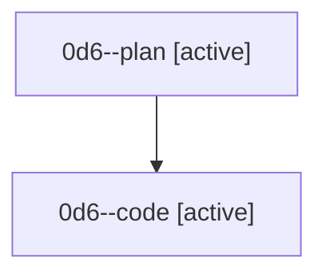

# Family: 0d6

[Agent Hoods](../README.md) / [bbugyi200](../users/bbugyi200/README.md) / [athena](../users/bbugyi200/machines/athena/README.md) / [0d6](../users/bbugyi200/machines/athena/hoods/0d6/README.md) / 0d6

Owner: `bbugyi200.athena` · Hood: `0d6` · Members: 2

## Lineage

The diagram is an optional enhancement; the ordered table below contains the same lineage in accessible text.

| Role | Agent | State | Model / provider | Timing | Commits | Prompt | Chat |
|---|---|---|---|---|---:|---|---|
| plan | 0d6--plan | active | opus / claude | 2026-08-24T23:18:42.670528+00:00 | 0 | [Prompt](../agents/bbugyi200.athena.0d6--plan/prompt.md) | [Chat](../agents/bbugyi200.athena.0d6--plan/chat.md) |
| code | 0d6--code | active | sonnet / claude | 2026-08-24T23:39:13.993275+00:00 | 0 | — | — |
