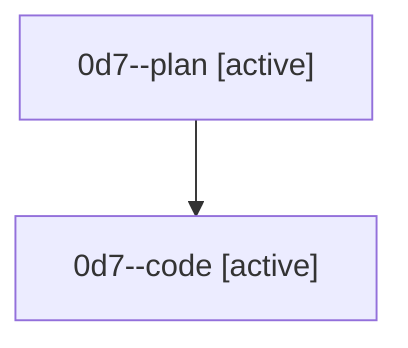

# Family: 0d7

[Agent Hoods](../README.md) / [bbugyi200](../users/bbugyi200/README.md) / [athena](../users/bbugyi200/machines/athena/README.md) / [0d7](../users/bbugyi200/machines/athena/hoods/0d7/README.md) / 0d7

Owner: `bbugyi200.athena` · Hood: `0d7` · Members: 2

## Lineage

The diagram is an optional enhancement; the ordered table below contains the same lineage in accessible text.

| Role | Agent | State | Model / provider | Timing | Commits | Prompt | Chat |
|---|---|---|---|---|---:|---|---|
| plan | 0d7--plan | active | gpt-5.6-sol / codex | 2026-08-25T10:56:59.152093+00:00 | 0 | [Prompt](../agents/bbugyi200.athena.0d7--plan/prompt.md) | [Chat](../agents/bbugyi200.athena.0d7--plan/chat.md) |
| code | 0d7--code | active | gpt-5.5 / codex | 2026-08-25T11:02:23.690440+00:00 | [1](../agents/bbugyi200.athena.0d7--code/README.md#commits) | — | — |

## Commits

| Role | Repo | Commit | Subject | Committed |
|---|---|---|---|---|
| code | sase | [`1a652b9`](https://github.com/sase-org/sase/commit/1a652b9e64ad7e11bd09537a05f86a4a3c42174c) | feat(tui): show community plugin repository owners | 2026-08-25 07:22:31 EDT |
