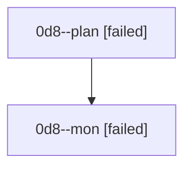

# Family: 0d8

[Agent Hoods](../README.md) / [bbugyi200](../users/bbugyi200/README.md) / [athena](../users/bbugyi200/machines/athena/README.md) / [0d8](../users/bbugyi200/machines/athena/hoods/0d8/README.md) / 0d8

Owner: `bbugyi200.athena` · Hood: `0d8` · Members: 2

## Lineage

The diagram is an optional enhancement; the ordered table below contains the same lineage in accessible text.

| Role | Agent | State | Model / provider | Timing | Commits | Prompt | Chat |
|---|---|---|---|---|---:|---|---|
| plan | 0d8--plan | failed | opus / claude | 2026-08-25T11:01:39.709808+00:00 → 2026-08-25T11:31:40.721932+00:00 | 0 | [Prompt](../agents/bbugyi200.athena.0d8--plan/prompt.md) | [Chat](../agents/bbugyi200.athena.0d8--plan/chat.md) |
| mon | 0d8--mon | failed | opus / claude | 2026-08-25T11:31:54.666053+00:00 | 0 | — | [Chat](../agents/bbugyi200.athena.0d8--mon/chat.md) |
