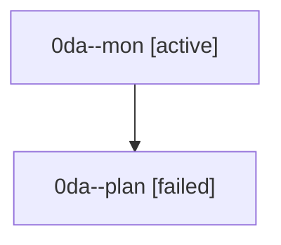

# Family: 0da

[Agent Hoods](../README.md) / [bbugyi200](../users/bbugyi200/README.md) / [athena](../users/bbugyi200/machines/athena/README.md) / [0da](../users/bbugyi200/machines/athena/hoods/0da/README.md) / 0da

Owner: `bbugyi200.athena` · Hood: `0da` · Members: 2

## Lineage

The diagram is an optional enhancement; the ordered table below contains the same lineage in accessible text.

| Role | Agent | State | Model / provider | Timing | Commits | Prompt | Chat |
|---|---|---|---|---|---:|---|---|
| mon | 0da--mon | active | opus / claude | 2026-08-25T12:09:32.235675+00:00 | 0 | — | — |
| plan | 0da--plan | failed | opus / claude | 2026-08-25T11:51:06.262270+00:00 → 2026-08-25T12:09:20.509015+00:00 | 0 | [Prompt](../agents/bbugyi200.athena.0da--plan/prompt.md) | [Chat](../agents/bbugyi200.athena.0da--plan/chat.md) |
