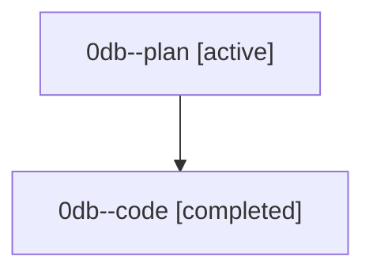

# Family: 0db

[Agent Hoods](../README.md) / [bbugyi200](../users/bbugyi200/README.md) / [athena](../users/bbugyi200/machines/athena/README.md) / [0db](../users/bbugyi200/machines/athena/hoods/0db/README.md) / 0db

Owner: `bbugyi200.athena` · Hood: `0db` · Members: 2

## Lineage

The diagram is an optional enhancement; the ordered table below contains the same lineage in accessible text.

| Role | Agent | State | Model / provider | Timing | Commits | Prompt | Chat |
|---|---|---|---|---|---:|---|---|
| plan | 0db--plan | active | gpt-5.6-sol / codex | 2026-08-25T12:13:20.900688+00:00 | 0 | [Prompt](../agents/bbugyi200.athena.0db--plan/prompt.md) | [Chat](../agents/bbugyi200.athena.0db--plan/chat.md) |
| code | 0db--code | completed | gpt-5.5 / codex | 2026-08-25T12:20:26.309840+00:00 → 2026-08-25T13:03:33.433317+00:00 | 0 | — | [Chat](../agents/bbugyi200.athena.0db--code/chat.md) |

## Commits

| Role | Repo | Commit | Subject | Committed |
|---|---|---|---|---|
| — | sase | [`615b1db`](https://github.com/sase-org/sase/commit/615b1db354cf53f957fa546999141788cdad3189) | feat(memory): add deferred memory read reports | 2026-08-25 10:52:42 EDT |
