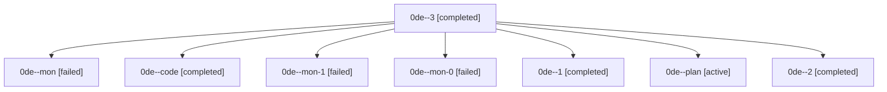

# Family: 0de

[Agent Hoods](../README.md) / [bbugyi200](../users/bbugyi200/README.md) / [athena](../users/bbugyi200/machines/athena/README.md) / [0de](../users/bbugyi200/machines/athena/hoods/0de/README.md) / 0de

Owner: `bbugyi200.athena` · Hood: `0de` · Members: 8

## Lineage

The diagram is an optional enhancement; the ordered table below contains the same lineage in accessible text.

| Role | Agent | State | Model / provider | Timing | Commits | Prompt | Chat |
|---|---|---|---|---|---:|---|---|
| 3 | 0de--3 | completed | sonnet / claude | 2026-08-25T14:49:46.919094+00:00 → 2026-08-25T14:55:24.024694+00:00 | [1](../agents/bbugyi200.athena.0de--3/README.md#commits) | [Prompt](../agents/bbugyi200.athena.0de--3/prompt.md) | [Chat](../agents/bbugyi200.athena.0de--3/chat.md) |
| mon | 0de--mon | failed | sonnet / claude | 2026-08-25T13:10:20.239491+00:00 | 0 | — | [Chat](../agents/bbugyi200.athena.0de--mon/chat.md) |
| code | 0de--code | completed | sonnet / claude | 2026-08-25T12:36:32.568929+00:00 → 2026-08-25T13:10:32.061493+00:00 | 0 | — | [Chat](../agents/bbugyi200.athena.0de--code/chat.md) |
| mon-1 | 0de--mon-1 | failed | sonnet / claude | 2026-08-25T14:09:38.262373+00:00 | 0 | — | [Chat](../agents/bbugyi200.athena.0de--mon-1/chat.md) |
| mon-0 | 0de--mon-0 | failed | sonnet / claude | 2026-08-25T13:19:40.862846+00:00 | 0 | — | [Chat](../agents/bbugyi200.athena.0de--mon-0/chat.md) |
| 1 | 0de--1 | completed | sonnet / claude | 2026-08-25T13:18:36.421456+00:00 → 2026-08-25T13:20:18.515245+00:00 | 0 | [Prompt](../agents/bbugyi200.athena.0de--1/prompt.md) | [Chat](../agents/bbugyi200.athena.0de--1/chat.md) |
| plan | 0de--plan | active | opus / claude | 2026-08-25T12:26:48.861864+00:00 | 0 | [Prompt](../agents/bbugyi200.athena.0de--plan/prompt.md) | [Chat](../agents/bbugyi200.athena.0de--plan/chat.md) |
| 2 | 0de--2 | completed | sonnet / claude | 2026-08-25T14:06:02.998261+00:00 → 2026-08-25T14:10:21.223766+00:00 | 0 | [Prompt](../agents/bbugyi200.athena.0de--2/prompt.md) | [Chat](../agents/bbugyi200.athena.0de--2/chat.md) |

## Commits

| Role | Repo | Commit | Subject | Committed |
|---|---|---|---|---|
| 3 | sase | [`1a96ea9`](https://github.com/sase-org/sase/commit/1a96ea92bf4dd066e20d51f024fb79001867232d) | fix(ace-tui): mount prompt bar immediately and gate relaunch on a cleanup barrier | 2026-08-25 10:52:02 EDT |
