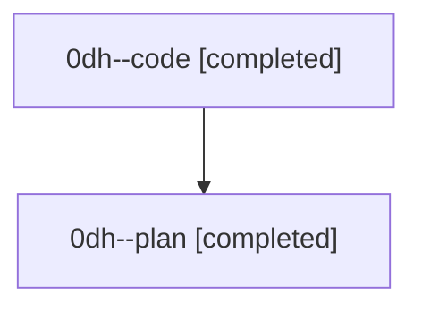

# Family: 0dh

[Agent Hoods](../README.md) / [bbugyi200](../users/bbugyi200/README.md) / [athena](../users/bbugyi200/machines/athena/README.md) / [0dh](../users/bbugyi200/machines/athena/hoods/0dh/README.md) / 0dh

Owner: `bbugyi200.athena` · Hood: `0dh` · Members: 2

## Lineage

The diagram is an optional enhancement; the ordered table below contains the same lineage in accessible text.

| Role | Agent | State | Model / provider | Timing | Commits | Prompt | Chat |
|---|---|---|---|---|---:|---|---|
| code | 0dh--code | completed | sonnet / claude | 2026-08-25T16:02:54.842419+00:00 → 2026-08-25T16:21:20.155975+00:00 | [1](../agents/bbugyi200.athena.0dh--code/README.md#commits) | — | [Chat](../agents/bbugyi200.athena.0dh--code/chat.md) |
| plan | 0dh--plan | completed | opus / claude | 2026-08-25T15:41:36.237147+00:00 → 2026-08-25T16:21:20.155975+00:00 | 0 | [Prompt](../agents/bbugyi200.athena.0dh--plan/prompt.md) | [Chat](../agents/bbugyi200.athena.0dh--plan/chat.md) |

## Commits

| Role | Repo | Commit | Subject | Committed |
|---|---|---|---|---|
| code | sase | [`cc66e7b`](https://github.com/sase-org/sase/commit/cc66e7bf321680feae3a781a51a1994eb2ef96fa) | feat(ace-tui): show clan/family/lane total runtime rows | 2026-08-25 12:20:22 EDT |
