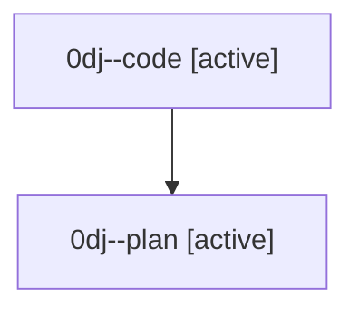

# Family: 0dj

[Agent Hoods](../README.md) / [bbugyi200](../users/bbugyi200/README.md) / [athena](../users/bbugyi200/machines/athena/README.md) / [0dj](../users/bbugyi200/machines/athena/hoods/0dj/README.md) / 0dj

Owner: `bbugyi200.athena` · Hood: `0dj` · Members: 2

## Lineage

The diagram is an optional enhancement; the ordered table below contains the same lineage in accessible text.

| Role | Agent | State | Model / provider | Timing | Commits | Prompt | Chat |
|---|---|---|---|---|---:|---|---|
| code | 0dj--code | active | gpt-5.5 / codex | 2026-08-25T16:08:39.964833+00:00 | 0 | — | — |
| plan | 0dj--plan | active | opus / claude | 2026-08-25T15:58:19.859764+00:00 | 0 | [Prompt](../agents/bbugyi200.athena.0dj--plan/prompt.md) | [Chat](../agents/bbugyi200.athena.0dj--plan/chat.md) |
