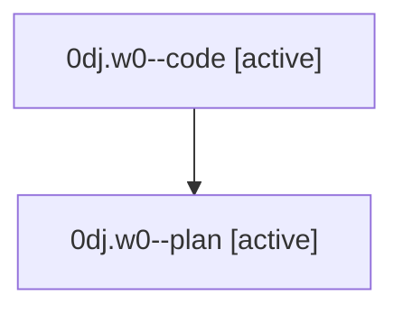

# Family: 0dj.w0

[Agent Hoods](../README.md) / [bbugyi200](../users/bbugyi200/README.md) / [athena](../users/bbugyi200/machines/athena/README.md) / [0dj](../users/bbugyi200/machines/athena/hoods/0dj/README.md) / 0dj.w0

Owner: `bbugyi200.athena` · Hood: `0dj` · Members: 2

## Lineage

The diagram is an optional enhancement; the ordered table below contains the same lineage in accessible text.

| Role | Agent | State | Model / provider | Timing | Commits | Prompt | Chat |
|---|---|---|---|---|---:|---|---|
| code | 0dj.w0--code | active | gpt-5.5 / codex | 2026-08-25T17:07:24.999705+00:00 | [1](../agents/bbugyi200.athena.0dj.w0--code/README.md#commits) | — | — |
| plan | 0dj.w0--plan | active | gpt-5.6-sol / codex | 2026-08-25T17:00:57.400054+00:00 | 0 | [Prompt](../agents/bbugyi200.athena.0dj.w0--plan/prompt.md) | [Chat](../agents/bbugyi200.athena.0dj.w0--plan/chat.md) |

## Commits

| Role | Repo | Commit | Subject | Committed |
|---|---|---|---|---|
| code | sase | [`6b22f7e`](https://github.com/sase-org/sase/commit/6b22f7e72d6d989c7350d3dec1ce41cc9ea0f5f5) | feat(task-types): render self-contained memory strands | 2026-08-25 13:41:03 EDT |

## Neighbors

| Agent | Relation | State |
|---|---|---|
| [0dj](bbugyi200.athena.0dj.md) (family · 2) | ancestor | completed 2 |
