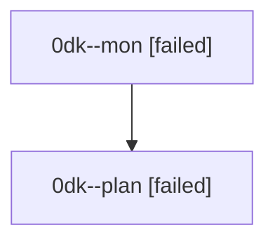

# Family: 0dk

[Agent Hoods](../README.md) / [bbugyi200](../users/bbugyi200/README.md) / [athena](../users/bbugyi200/machines/athena/README.md) / [0dk](../users/bbugyi200/machines/athena/hoods/0dk/README.md) / 0dk

Owner: `bbugyi200.athena` · Hood: `0dk` · Members: 2

## Lineage

The diagram is an optional enhancement; the ordered table below contains the same lineage in accessible text.

| Role | Agent | State | Model / provider | Timing | Commits | Prompt | Chat |
|---|---|---|---|---|---:|---|---|
| mon | 0dk--mon | failed | opus / claude | 2026-08-25T16:36:17.532954+00:00 | 0 | — | [Chat](../agents/bbugyi200.athena.0dk--mon/chat.md) |
| plan | 0dk--plan | failed | opus / claude | 2026-08-25T16:18:43.496427+00:00 → 2026-08-25T16:36:02.286526+00:00 | 0 | [Prompt](../agents/bbugyi200.athena.0dk--plan/prompt.md) | [Chat](../agents/bbugyi200.athena.0dk--plan/chat.md) |
