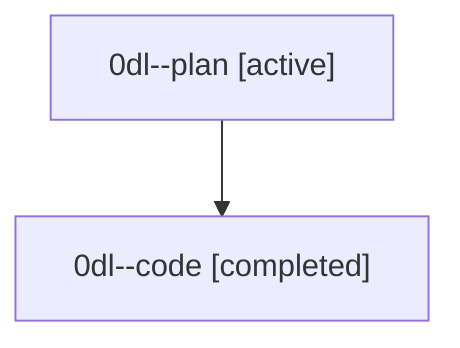

# Family: 0dl

[Agent Hoods](../README.md) / [bbugyi200](../users/bbugyi200/README.md) / [athena](../users/bbugyi200/machines/athena/README.md) / [0dl](../users/bbugyi200/machines/athena/hoods/0dl/README.md) / 0dl

Owner: `bbugyi200.athena` · Hood: `0dl` · Members: 2

## Lineage

The diagram is an optional enhancement; the ordered table below contains the same lineage in accessible text.

| Role | Agent | State | Model / provider | Timing | Commits | Prompt | Chat |
|---|---|---|---|---|---:|---|---|
| plan | 0dl--plan | active | opus / claude | 2026-08-25T16:37:58.391767+00:00 | 0 | [Prompt](../agents/bbugyi200.athena.0dl--plan/prompt.md) | [Chat](../agents/bbugyi200.athena.0dl--plan/chat.md) |
| code | 0dl--code | completed | sonnet / claude | 2026-08-25T16:42:28.733751+00:00 → 2026-08-25T17:11:42.255545+00:00 | 0 | — | [Chat](../agents/bbugyi200.athena.0dl--code/chat.md) |

## Commits

| Role | Repo | Commit | Subject | Committed |
|---|---|---|---|---|
| — | sase | [`21b49aa`](https://github.com/sase-org/sase/commit/21b49aa98a4dd73cd0abc14d4a78fd7cd00f9cce) | docs(memory): refresh Memory Web glossary strands to describe the shipped substrate | 2026-08-25 13:10:54 EDT |
