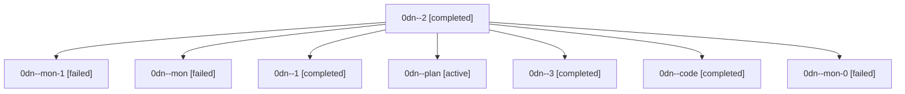

# Family: 0dn

[Agent Hoods](../README.md) / [bbugyi200](../users/bbugyi200/README.md) / [athena](../users/bbugyi200/machines/athena/README.md) / [0dn](../users/bbugyi200/machines/athena/hoods/0dn/README.md) / 0dn

Owner: `bbugyi200.athena` · Hood: `0dn` · Members: 8

## Lineage

The diagram is an optional enhancement; the ordered table below contains the same lineage in accessible text.

| Role | Agent | State | Model / provider | Timing | Commits | Prompt | Chat |
|---|---|---|---|---|---:|---|---|
| 2 | 0dn--2 | completed | sonnet / claude | 2026-08-25T18:50:06.185724+00:00 → 2026-08-25T18:53:42.733239+00:00 | 0 | [Prompt](../agents/bbugyi200.athena.0dn--2/prompt.md) | [Chat](../agents/bbugyi200.athena.0dn--2/chat.md) |
| mon-1 | 0dn--mon-1 | failed | sonnet / claude | 2026-08-25T18:53:33.588455+00:00 | 0 | — | [Chat](../agents/bbugyi200.athena.0dn--mon-1/chat.md) |
| mon | 0dn--mon | failed | sonnet / claude | 2026-08-25T18:42:50.303184+00:00 | 0 | — | [Chat](../agents/bbugyi200.athena.0dn--mon/chat.md) |
| 1 | 0dn--1 | completed | sonnet / claude | 2026-08-25T18:46:24.610675+00:00 → 2026-08-25T18:47:34.485225+00:00 | 0 | [Prompt](../agents/bbugyi200.athena.0dn--1/prompt.md) | [Chat](../agents/bbugyi200.athena.0dn--1/chat.md) |
| plan | 0dn--plan | active | opus / claude | 2026-08-25T18:23:51.014489+00:00 | 0 | [Prompt](../agents/bbugyi200.athena.0dn--plan/prompt.md) | [Chat](../agents/bbugyi200.athena.0dn--plan/chat.md) |
| 3 | 0dn--3 | completed | sonnet / claude | 2026-08-25T19:08:20.748404+00:00 → 2026-08-25T19:13:11.144842+00:00 | [1](../agents/bbugyi200.athena.0dn--3/README.md#commits) | [Prompt](../agents/bbugyi200.athena.0dn--3/prompt.md) | [Chat](../agents/bbugyi200.athena.0dn--3/chat.md) |
| code | 0dn--code | completed | sonnet / claude | 2026-08-25T18:31:43.439028+00:00 → 2026-08-25T18:42:59.697351+00:00 | 0 | — | [Chat](../agents/bbugyi200.athena.0dn--code/chat.md) |
| mon-0 | 0dn--mon-0 | failed | sonnet / claude | 2026-08-25T18:47:24.969003+00:00 | 0 | — | [Chat](../agents/bbugyi200.athena.0dn--mon-0/chat.md) |

## Commits

| Role | Repo | Commit | Subject | Committed |
|---|---|---|---|---|
| 3 | sase | [`e5cd318`](https://github.com/sase-org/sase/commit/e5cd318b8eef1117b1152f6530908466b2d55ec2) | feat(ace): fall back to interactive identity for memory panel audit logging | 2026-08-25 15:09:49 EDT |
