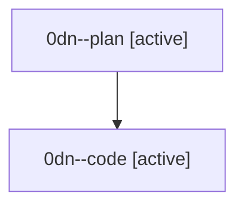

# Family: 0dn

[Agent Hoods](../README.md) / [bbugyi200](../users/bbugyi200/README.md) / [athena](../users/bbugyi200/machines/athena/README.md) / [0dn](../users/bbugyi200/machines/athena/hoods/0dn/README.md) / 0dn

Owner: `bbugyi200.athena` · Hood: `0dn` · Members: 2

## Lineage

The diagram is an optional enhancement; the ordered table below contains the same lineage in accessible text.

| Role | Agent | State | Model / provider | Timing | Commits | Prompt | Chat |
|---|---|---|---|---|---:|---|---|
| plan | 0dn--plan | active | opus / claude | 2026-08-25T18:23:51.014489+00:00 | 0 | [Prompt](../agents/bbugyi200.athena.0dn--plan/prompt.md) | [Chat](../agents/bbugyi200.athena.0dn--plan/chat.md) |
| code | 0dn--code | active | sonnet / claude | 2026-08-25T18:31:43.439028+00:00 | 0 | — | — |
