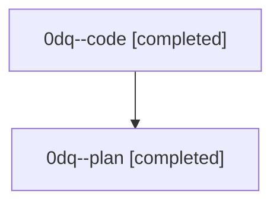

# Family: 0dq

[Agent Hoods](../README.md) / [bbugyi200](../users/bbugyi200/README.md) / [athena](../users/bbugyi200/machines/athena/README.md) / [0dq](../users/bbugyi200/machines/athena/hoods/0dq/README.md) / 0dq

Owner: `bbugyi200.athena` · Hood: `0dq` · Members: 2

## Lineage

The diagram is an optional enhancement; the ordered table below contains the same lineage in accessible text.

| Role | Agent | State | Model / provider | Timing | Commits | Prompt | Chat |
|---|---|---|---|---|---:|---|---|
| code | 0dq--code | completed | sonnet / claude | 2026-08-25T19:07:18.006953+00:00 → 2026-08-25T19:37:12.704869+00:00 | [1](../agents/bbugyi200.athena.0dq--code/README.md#commits) | — | [Chat](../agents/bbugyi200.athena.0dq--code/chat.md) |
| plan | 0dq--plan | completed | opus / claude | 2026-08-25T18:48:26.918214+00:00 → 2026-08-25T19:37:12.704869+00:00 | 0 | [Prompt](../agents/bbugyi200.athena.0dq--plan/prompt.md) | [Chat](../agents/bbugyi200.athena.0dq--plan/chat.md) |

## Commits

| Role | Repo | Commit | Subject | Committed |
|---|---|---|---|---|
| code | sase | [`46fc307`](https://github.com/sase-org/sase/commit/46fc307d83f7c5d68be943ddde6681079541f37f) | feat(sase): make beads sidecar lazy-clone by default | 2026-08-25 15:36:18 EDT |
