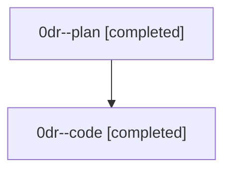

# Family: 0dr

[Agent Hoods](../README.md) / [bbugyi200](../users/bbugyi200/README.md) / [athena](../users/bbugyi200/machines/athena/README.md) / [0dr](../users/bbugyi200/machines/athena/hoods/0dr/README.md) / 0dr

Owner: `bbugyi200.athena` · Hood: `0dr` · Members: 2

## Lineage

The diagram is an optional enhancement; the ordered table below contains the same lineage in accessible text.

| Role | Agent | State | Model / provider | Timing | Commits | Prompt | Chat |
|---|---|---|---|---|---:|---|---|
| plan | 0dr--plan | completed | opus / claude | 2026-08-25T18:52:22.925685+00:00 → 2026-08-25T19:19:35.063603+00:00 | 0 | [Prompt](../agents/bbugyi200.athena.0dr--plan/prompt.md) | [Chat](../agents/bbugyi200.athena.0dr--plan/chat.md) |
| code | 0dr--code | completed | gpt-5.5 / codex | 2026-08-25T18:58:37.286855+00:00 → 2026-08-25T19:19:35.063603+00:00 | [1](../agents/bbugyi200.athena.0dr--code/README.md#commits) | — | [Chat](../agents/bbugyi200.athena.0dr--code/chat.md) |

## Commits

| Role | Repo | Commit | Subject | Committed |
|---|---|---|---|---|
| code | sase | [`51bb2f1`](https://github.com/sase-org/sase/commit/51bb2f136663f0ebbf9a54a60ee2ffce05bc2294) | fix(memory): strip roster markers from agent docs | 2026-08-25 15:18:49 EDT |

## Neighbors

| Agent | Relation | State |
|---|---|---|
| [0dr.w0](bbugyi200.athena.0dr.w0.md) (family · 4) | descendant | active 1, completed 2, failed 1 |
