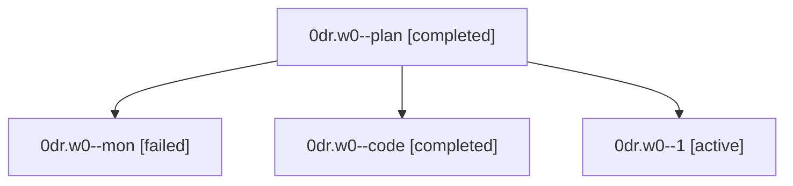

# Family: 0dr.w0

[Agent Hoods](../README.md) / [bbugyi200](../users/bbugyi200/README.md) / [athena](../users/bbugyi200/machines/athena/README.md) / [0dr](../users/bbugyi200/machines/athena/hoods/0dr/README.md) / 0dr.w0

Owner: `bbugyi200.athena` · Hood: `0dr` · Members: 4

## Lineage

The diagram is an optional enhancement; the ordered table below contains the same lineage in accessible text.

| Role | Agent | State | Model / provider | Timing | Commits | Prompt | Chat |
|---|---|---|---|---|---:|---|---|
| plan | 0dr.w0--plan | completed | gpt-5.6-sol / codex | 2026-08-25T19:19:47.256247+00:00 → 2026-08-25T19:36:10.337633+00:00 | 0 | [Prompt](../agents/bbugyi200.athena.0dr.w0--plan/prompt.md) | [Chat](../agents/bbugyi200.athena.0dr.w0--plan/chat.md) |
| mon | 0dr.w0--mon | failed | sonnet / claude | 2026-08-25T19:35:55.205009+00:00 | 0 | — | [Chat](../agents/bbugyi200.athena.0dr.w0--mon/chat.md) |
| code | 0dr.w0--code | completed | sonnet / claude | 2026-08-25T19:24:12.592211+00:00 → 2026-08-25T19:36:10.337633+00:00 | 0 | — | [Chat](../agents/bbugyi200.athena.0dr.w0--code/chat.md) |
| 1 | 0dr.w0--1 | active | sonnet / claude | 2026-08-25T19:39:13.681449+00:00 | [1](../agents/bbugyi200.athena.0dr.w0--1/README.md#commits) | [Prompt](../agents/bbugyi200.athena.0dr.w0--1/prompt.md) | — |

## Commits

| Role | Repo | Commit | Subject | Committed |
|---|---|---|---|---|
| 1 | sase | [`8776211`](https://github.com/sase-org/sase/commit/877621113041f1ada918f8f9b0403f388ab2675f) | docs(memory): drop stale project/repo glossary aliases, add sase memory alias | 2026-08-25 15:42:43 EDT |

## Neighbors

| Agent | Relation | State |
|---|---|---|
| [0dr](bbugyi200.athena.0dr.md) (family · 2) | ancestor | completed 2 |
