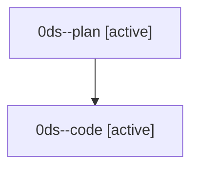

# Family: 0ds

[Agent Hoods](../README.md) / [bbugyi200](../users/bbugyi200/README.md) / [athena](../users/bbugyi200/machines/athena/README.md) / [0ds](../users/bbugyi200/machines/athena/hoods/0ds/README.md) / 0ds

Owner: `bbugyi200.athena` · Hood: `0ds` · Members: 2

## Lineage

The diagram is an optional enhancement; the ordered table below contains the same lineage in accessible text.

| Role | Agent | State | Model / provider | Timing | Commits | Prompt | Chat |
|---|---|---|---|---|---:|---|---|
| plan | 0ds--plan | active | opus / claude | 2026-08-25T19:50:27.404680+00:00 | 0 | [Prompt](../agents/bbugyi200.athena.0ds--plan/prompt.md) | [Chat](../agents/bbugyi200.athena.0ds--plan/chat.md) |
| code | 0ds--code | active | sonnet / claude | 2026-08-25T20:04:51.139388+00:00 | 0 | — | — |
