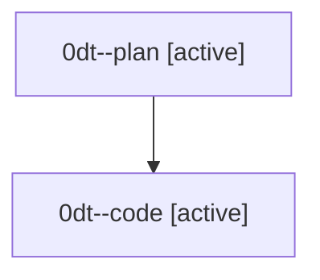

# Family: 0dt

[Agent Hoods](../README.md) / [bbugyi200](../users/bbugyi200/README.md) / [athena](../users/bbugyi200/machines/athena/README.md) / [0dt](../users/bbugyi200/machines/athena/hoods/0dt/README.md) / 0dt

Owner: `bbugyi200.athena` · Hood: `0dt` · Members: 2

## Lineage

The diagram is an optional enhancement; the ordered table below contains the same lineage in accessible text.

| Role | Agent | State | Model / provider | Timing | Commits | Prompt | Chat |
|---|---|---|---|---|---:|---|---|
| plan | 0dt--plan | active | opus / claude | 2026-08-25T20:05:41.222848+00:00 | 0 | [Prompt](../agents/bbugyi200.athena.0dt--plan/prompt.md) | [Chat](../agents/bbugyi200.athena.0dt--plan/chat.md) |
| code | 0dt--code | active | sonnet / claude | 2026-08-25T20:18:58.224808+00:00 | [1](../agents/bbugyi200.athena.0dt--code/README.md#commits) | — | — |

## Commits

| Role | Repo | Commit | Subject | Committed |
|---|---|---|---|---|
| code | sase | [`44ce806`](https://github.com/sase-org/sase/commit/44ce8061276bd420e9baa6b447460f5f0da9e3ca) | feat(ace): add section jump targets to metadata fold sections | 2026-08-25 17:02:46 EDT |
