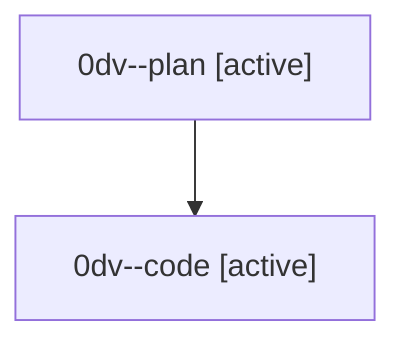

# Family: 0dv

[Agent Hoods](../README.md) / [bbugyi200](../users/bbugyi200/README.md) / [athena](../users/bbugyi200/machines/athena/README.md) / [0dv](../users/bbugyi200/machines/athena/hoods/0dv/README.md) / 0dv

Owner: `bbugyi200.athena` · Hood: `0dv` · Members: 2

## Lineage

The diagram is an optional enhancement; the ordered table below contains the same lineage in accessible text.

| Role | Agent | State | Model / provider | Timing | Commits | Prompt | Chat |
|---|---|---|---|---|---:|---|---|
| plan | 0dv--plan | active | opus / claude | 2026-08-25T21:50:28.670965+00:00 | 0 | [Prompt](../agents/bbugyi200.athena.0dv--plan/prompt.md) | [Chat](../agents/bbugyi200.athena.0dv--plan/chat.md) |
| code | 0dv--code | active | gpt-5.5 / codex | 2026-08-25T22:01:36.648637+00:00 | 0 | — | — |
