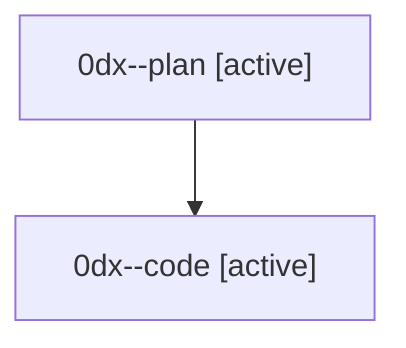

# Family: 0dx

[Agent Hoods](../README.md) / [bbugyi200](../users/bbugyi200/README.md) / [athena](../users/bbugyi200/machines/athena/README.md) / [0dx](../users/bbugyi200/machines/athena/hoods/0dx/README.md) / 0dx

Owner: `bbugyi200.athena` · Hood: `0dx` · Members: 2

## Lineage

The diagram is an optional enhancement; the ordered table below contains the same lineage in accessible text.

| Role | Agent | State | Model / provider | Timing | Commits | Prompt | Chat |
|---|---|---|---|---|---:|---|---|
| plan | 0dx--plan | active | gpt-5.6-sol / codex | 2026-08-26T06:39:32.930809+00:00 | 0 | [Prompt](../agents/bbugyi200.athena.0dx--plan/prompt.md) | [Chat](../agents/bbugyi200.athena.0dx--plan/chat.md) |
| code | 0dx--code | active | gpt-5.5 / codex | 2026-08-26T09:02:47.143501+00:00 | 0 | — | — |
