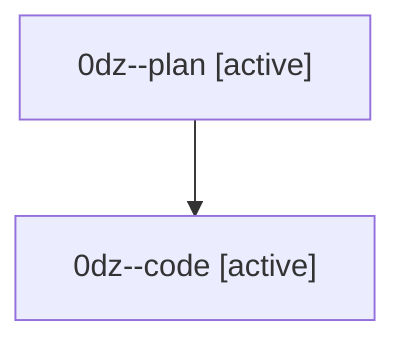

# Family: 0dz

[Agent Hoods](../README.md) / [bbugyi200](../users/bbugyi200/README.md) / [athena](../users/bbugyi200/machines/athena/README.md) / [0dz](../users/bbugyi200/machines/athena/hoods/0dz/README.md) / 0dz

Owner: `bbugyi200.athena` · Hood: `0dz` · Members: 2

## Lineage

The diagram is an optional enhancement; the ordered table below contains the same lineage in accessible text.

| Role | Agent | State | Model / provider | Timing | Commits | Prompt | Chat |
|---|---|---|---|---|---:|---|---|
| plan | 0dz--plan | active | opus / claude | 2026-08-26T11:09:00.559524+00:00 | 0 | [Prompt](../agents/bbugyi200.athena.0dz--plan/prompt.md) | [Chat](../agents/bbugyi200.athena.0dz--plan/chat.md) |
| code | 0dz--code | active | gpt-5.5 / codex | 2026-08-26T11:20:44.389681+00:00 | 0 | — | — |
