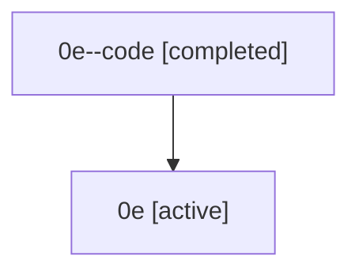

# Family: 0e

Owner: `bbugyi200.athena` · Hood: `0e` · Members: 2

## Lineage

The diagram is an optional enhancement; the ordered table below contains the same lineage in accessible text.

| Role | Agent | State | Model / provider | Timing | Commits | Prompt | Chat |
|---|---|---|---|---|---:|---|---|
| code | 0e--code | completed | gpt-5.5 / codex | 2026-07-07T15:13:40.459757+00:00 | 0 | — | [Chat](../agents/bbugyi200.athena.0e--code/chat.md) |
| root | 0e | active | gpt-5.5 / codex | 2026-07-07T15:00:37.715194+00:00 | 6 | [Prompt](../agents/bbugyi200.athena.0e/prompt.md) | [Chat](../agents/bbugyi200.athena.0e/chat.md) |
