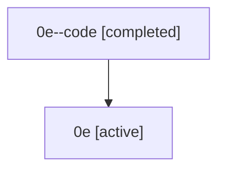

# Family: 0e

[Agent Hoods](../README.md) / [bbugyi200](../users/bbugyi200/README.md) / [athena](../users/bbugyi200/machines/athena/README.md) / [0e](../users/bbugyi200/machines/athena/hoods/0e/README.md) / 0e

Owner: `bbugyi200.athena` · Hood: `0e` · Members: 2

## Lineage

The diagram is an optional enhancement; the ordered table below contains the same lineage in accessible text.

| Role | Agent | State | Model / provider | Timing | Commits | Prompt | Chat |
|---|---|---|---|---|---:|---|---|
| code | 0e--code | completed | gpt-5.5 / codex | 2026-07-07T15:13:40.459757+00:00 | 0 | — | [Chat](../agents/bbugyi200.athena.0e--code/chat.md) |
| root | 0e | active | gpt-5.5 / codex | 2026-07-07T15:00:37.715194+00:00 | [6](../agents/bbugyi200.athena.0e/README.md#commits) | [Prompt](../agents/bbugyi200.athena.0e/prompt.md) | [Chat](../agents/bbugyi200.athena.0e/chat.md) |

## Commits

| Role | Repo | Commit | Subject | Committed (UTC) |
|---|---|---|---|---|
| root | sase | [`5924868`](https://github.com/sase-org/sase/commit/5924868b0c5db0b7000e6c80f8f28a398d77050c) | chore: Add SDD prompt and plan for sase\_var\_output\_variables | 2026-06-03 00:19:08 |
| root | sase | [`68716ab`](https://github.com/sase-org/sase/commit/68716ab4c603128d02bfaf79ddd510508aa3584d) | chore: create sase var output variable epic beads | 2026-06-03 00:23:43 |
| root | sase | [`932b6fa`](https://github.com/sase-org/sase/commit/932b6fa3a1657c6db6c7d024b9ff1ee182f73484) | chore: Add SDD prompt and plan for agents\_tab\_auto\_approve\_prefix\_and\_child\_alignment | 2026-07-06 01:37:09 |
| root | sase | [`3e4c53d`](https://github.com/sase-org/sase/commit/3e4c53d359c795a9d80338b5b98fe018688ad99c) | fix(tui): align workflow child approval indicators | 2026-07-06 02:18:56 |
| root | sase | [`c5f48b6`](https://github.com/sase-org/sase/commit/c5f48b6d601915c4fab8b3d7b7870502c2d2f4e3) | chore: Add SDD prompt and plan for popup\_panel\_tab\_switch\_keymaps | 2026-07-07 15:13:39 |
| root | sase | [`904a3e1`](https://github.com/sase-org/sase/commit/904a3e1514308972d27afc79914de6a90a5bedcf) | fix(ace): support tab switching in popup panels | 2026-07-07 15:28:42 |

## Neighbors

| Agent | Relation | State |
|---|---|---|
| [0e.w1](bbugyi200.athena.0e.w1.md) (family · 2) | descendant | active 1, completed 1 |
| [0e.w1.w1](bbugyi200.athena.0e.w1.w1.md) (family · 2) | descendant | active 1, completed 1 |
| [0e.w1.w1.w1](bbugyi200.athena.0e.w1.w1.w1.md) (family · 2) | descendant | active 1, completed 1 |
| [0e.w1.w1.w1.f1](bbugyi200.athena.0e.w1.w1.w1.f1.md) (family · 2) | descendant | active 1, completed 1 |
