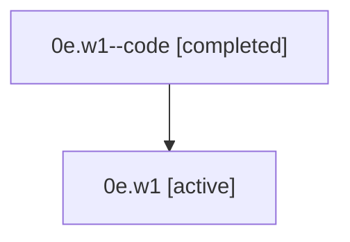

# Family: 0e.w1

[Agent Hoods](../README.md) / [bbugyi200](../users/bbugyi200/README.md) / [athena](../users/bbugyi200/machines/athena/README.md) / [0e](../users/bbugyi200/machines/athena/hoods/0e/README.md) / 0e.w1

Owner: `bbugyi200.athena` · Hood: `0e` · Members: 2

## Lineage

The diagram is an optional enhancement; the ordered table below contains the same lineage in accessible text.

| Role | Agent | State | Model / provider | Timing | Commits | Prompt | Chat |
|---|---|---|---|---|---:|---|---|
| code | 0e.w1--code | completed | gpt-5.5 / codex | 2026-07-07T15:36:25.489110+00:00 | 0 | — | [Chat](../agents/bbugyi200.athena.0e.w1--code/chat.md) |
| root | 0e.w1 | active | claude-fable-5 / claude | 2026-07-07T15:29:01.244630+00:00 | [2](../agents/bbugyi200.athena.0e.w1/README.md#commits) | [Prompt](../agents/bbugyi200.athena.0e.w1/prompt.md) | [Chat](../agents/bbugyi200.athena.0e.w1/chat.md) |

## Commits

| Role | Repo | Commit | Subject | Committed (UTC) |
|---|---|---|---|---|
| root | sase | [`3e3cdb8`](https://github.com/sase-org/sase/commit/3e3cdb8c48a7302cbf4b5adf990e2ba4b7c9f0cf) | chore: Add SDD prompt and plan for tab\_guide\_content\_improvements | 2026-07-07 15:36:24 |
| root | sase | [`410e885`](https://github.com/sase-org/sase/commit/410e885325c8f01cf1e2394f513c60eedbcb0a44) | feat(tui): improve ACE tab guide content | 2026-07-07 15:50:27 |

## Neighbors

| Agent | Relation | State |
|---|---|---|
| [0e](bbugyi200.athena.0e.md) (family · 2) | ancestor | active 1, completed 1 |
| [0e.w1.w1](bbugyi200.athena.0e.w1.w1.md) (family · 2) | descendant | active 1, completed 1 |
| [0e.w1.w1.w1](bbugyi200.athena.0e.w1.w1.w1.md) (family · 2) | descendant | active 1, completed 1 |
| [0e.w1.w1.w1.f1](bbugyi200.athena.0e.w1.w1.w1.f1.md) (family · 2) | descendant | active 1, completed 1 |
