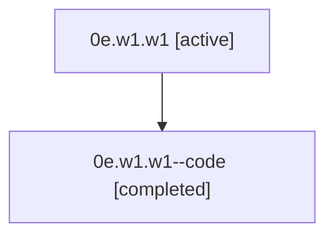

# Family: 0e.w1.w1

[Agent Hoods](../README.md) / [bbugyi200](../users/bbugyi200/README.md) / [athena](../users/bbugyi200/machines/athena/README.md) / [0e](../users/bbugyi200/machines/athena/hoods/0e/README.md) / 0e.w1.w1

Owner: `bbugyi200.athena` · Hood: `0e` · Members: 2

## Lineage

The diagram is an optional enhancement; the ordered table below contains the same lineage in accessible text.

| Role | Agent | State | Model / provider | Timing | Commits | Prompt | Chat |
|---|---|---|---|---|---:|---|---|
| root | 0e.w1.w1 | active | gpt-5.5 / codex | 2026-07-07T15:50:57.184205+00:00 | [2](../agents/bbugyi200.athena.0e.w1.w1/README.md#commits) | [Prompt](../agents/bbugyi200.athena.0e.w1.w1/prompt.md) | [Chat](../agents/bbugyi200.athena.0e.w1.w1/chat.md) |
| code | 0e.w1.w1--code | completed | gpt-5.5 / codex | 2026-07-07T15:55:25.943557+00:00 | 0 | — | [Chat](../agents/bbugyi200.athena.0e.w1.w1--code/chat.md) |

## Commits

| Role | Repo | Commit | Subject | Committed (UTC) |
|---|---|---|---|---|
| root | sase | [`672f706`](https://github.com/sase-org/sase/commit/672f7068ee588c6e0edfa9e5059170df59dea6b1) | chore: Add SDD prompt and plan for pr\_terminology\_rename | 2026-07-07 15:55:24 |
| root | sase | [`ba6d2a1`](https://github.com/sase-org/sase/commit/ba6d2a1e57fd5e6bd93cf444555d58c04b839988) | feat: use PR terminology for ChangeSpec reviews | 2026-07-07 16:54:38 |

## Neighbors

| Agent | Relation | State |
|---|---|---|
| [0e.w1](bbugyi200.athena.0e.w1.md) (family · 2) | ancestor | active 1, completed 1 |
| [0e](bbugyi200.athena.0e.md) (family · 2) | ancestor | active 1, completed 1 |
| [0e.w1.w1.w1](bbugyi200.athena.0e.w1.w1.w1.md) (family · 2) | descendant | active 1, completed 1 |
| [0e.w1.w1.w1.f1](bbugyi200.athena.0e.w1.w1.w1.f1.md) (family · 2) | descendant | active 1, completed 1 |
