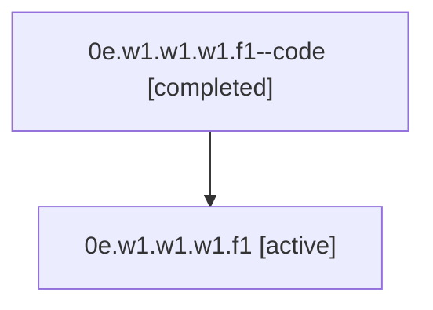

# Family: 0e.w1.w1.w1.f1

[Agent Hoods](../README.md) / [bbugyi200](../users/bbugyi200/README.md) / [athena](../users/bbugyi200/machines/athena/README.md) / [0e](../users/bbugyi200/machines/athena/hoods/0e/README.md) / 0e.w1.w1.w1.f1

Owner: `bbugyi200.athena` · Hood: `0e` · Members: 2

## Lineage

The diagram is an optional enhancement; the ordered table below contains the same lineage in accessible text.

| Role | Agent | State | Model / provider | Timing | Commits | Prompt | Chat |
|---|---|---|---|---|---:|---|---|
| code | 0e.w1.w1.w1.f1--code | completed | gpt-5.5 / codex | 2026-07-07T17:47:00.413377+00:00 | [1](../agents/bbugyi200.athena.0e.w1.w1.w1.f1--code/README.md#commits) | — | [Chat](../agents/bbugyi200.athena.0e.w1.w1.w1.f1--code/chat.md) |
| root | 0e.w1.w1.w1.f1 | active | gpt-5.5 / codex | 2026-07-07T17:43:45.392926+00:00 | [2](../agents/bbugyi200.athena.0e.w1.w1.w1.f1/README.md#commits) | [Prompt](../agents/bbugyi200.athena.0e.w1.w1.w1.f1/prompt.md) | [Chat](../agents/bbugyi200.athena.0e.w1.w1.w1.f1/chat.md) |

## Commits

| Role | Commit | Subject | Committed (UTC) |
|---|---|---|---|
| root | [`9d16bd5`](https://github.com/sase-org/sase/commit/9d16bd5418a61eaedb257ba9fbddc8c593323cf7) | chore: Add SDD prompt and plan for expand\_help\_panel | 2026-07-07 17:46:59 |
| code | [`306b5ec`](https://github.com/sase-org/sase/commit/306b5ec957dbc162f8ba1f72c7eb3b409389cb27) | fix(ace): expand help panel viewport usage | 2026-07-07 17:56:22 |
| root | [`306b5ec`](https://github.com/sase-org/sase/commit/306b5ec957dbc162f8ba1f72c7eb3b409389cb27) | fix(ace): expand help panel viewport usage | 2026-07-07 17:56:22 |

## Neighbors

| Agent | Relation | State |
|---|---|---|
| [0e.w1.w1.w1](bbugyi200.athena.0e.w1.w1.w1.md) (family · 2) | ancestor | active 1, completed 1 |
| [0e.w1.w1](bbugyi200.athena.0e.w1.w1.md) (family · 2) | ancestor | active 1, completed 1 |
| [0e.w1](bbugyi200.athena.0e.w1.md) (family · 2) | ancestor | active 1, completed 1 |
| [0e](bbugyi200.athena.0e.md) (family · 2) | ancestor | active 1, completed 1 |
