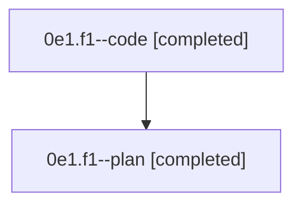

# Family: 0e1.f1

[Agent Hoods](../README.md) / [bbugyi200](../users/bbugyi200/README.md) / [athena](../users/bbugyi200/machines/athena/README.md) / [0e1](../users/bbugyi200/machines/athena/hoods/0e1/README.md) / 0e1.f1

Owner: `bbugyi200.athena` · Hood: `0e1` · Members: 2

## Lineage

The diagram is an optional enhancement; the ordered table below contains the same lineage in accessible text.

| Role | Agent | State | Model / provider | Timing | Commits | Prompt | Chat |
|---|---|---|---|---|---:|---|---|
| code | 0e1.f1--code | completed | sonnet / claude | 2026-08-26T12:15:34.079439+00:00 → 2026-08-26T12:49:07.484931+00:00 | [1](../agents/bbugyi200.athena.0e1.f1--code/README.md#commits) | — | [Chat](../agents/bbugyi200.athena.0e1.f1--code/chat.md) |
| plan | 0e1.f1--plan | completed | opus / claude | 2026-08-26T11:52:46.130548+00:00 → 2026-08-26T12:49:07.484931+00:00 | 0 | [Prompt](../agents/bbugyi200.athena.0e1.f1--plan/prompt.md) | [Chat](../agents/bbugyi200.athena.0e1.f1--plan/chat.md) |

## Commits

| Role | Repo | Commit | Subject | Committed |
|---|---|---|---|---|
| code | sase | [`9351d79`](https://github.com/sase-org/sase/commit/9351d7953cb41250f639a9f32c061627ff0c94a9) | feat(bead): add show epic expansion for \`\<epic-id\>..\` batch queries | 2026-08-26 08:48:11 EDT |

## Neighbors

| Agent | Relation | State |
|---|---|---|
| [0e1](../agents/bbugyi200.athena.0e1/README.md) | ancestor | completed |
| [0e1.f0](../agents/bbugyi200.athena.0e1.f0/README.md) | 0e1 hood | dismissed |
