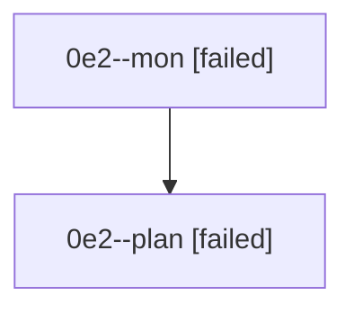

# Family: 0e2

[Agent Hoods](../README.md) / [bbugyi200](../users/bbugyi200/README.md) / [athena](../users/bbugyi200/machines/athena/README.md) / [0e2](../users/bbugyi200/machines/athena/hoods/0e2/README.md) / 0e2

Owner: `bbugyi200.athena` · Hood: `0e2` · Members: 2

## Lineage

The diagram is an optional enhancement; the ordered table below contains the same lineage in accessible text.

| Role | Agent | State | Model / provider | Timing | Commits | Prompt | Chat |
|---|---|---|---|---|---:|---|---|
| mon | 0e2--mon | failed | opus / claude | 2026-08-26T11:55:07.707387+00:00 | 0 | — | [Chat](../agents/bbugyi200.athena.0e2--mon/chat.md) |
| plan | 0e2--plan | failed | opus / claude | 2026-08-26T11:41:32.908940+00:00 → 2026-08-26T11:54:51.289343+00:00 | 0 | [Prompt](../agents/bbugyi200.athena.0e2--plan/prompt.md) | [Chat](../agents/bbugyi200.athena.0e2--plan/chat.md) |
