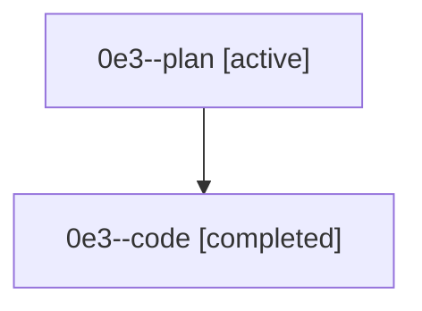

# Family: 0e3

[Agent Hoods](../README.md) / [bbugyi200](../users/bbugyi200/README.md) / [athena](../users/bbugyi200/machines/athena/README.md) / [0e3](../users/bbugyi200/machines/athena/hoods/0e3/README.md) / 0e3

Owner: `bbugyi200.athena` · Hood: `0e3` · Members: 2

## Lineage

The diagram is an optional enhancement; the ordered table below contains the same lineage in accessible text.

| Role | Agent | State | Model / provider | Timing | Commits | Prompt | Chat |
|---|---|---|---|---|---:|---|---|
| plan | 0e3--plan | active | opus / claude | 2026-08-26T11:47:48.505978+00:00 | 0 | [Prompt](../agents/bbugyi200.athena.0e3--plan/prompt.md) | [Chat](../agents/bbugyi200.athena.0e3--plan/chat.md) |
| code | 0e3--code | completed | gpt-5.5 / codex | 2026-08-26T11:58:44.997647+00:00 → 2026-08-26T12:41:58.876407+00:00 | [1](../agents/bbugyi200.athena.0e3--code/README.md#commits) | — | [Chat](../agents/bbugyi200.athena.0e3--code/chat.md) |

## Commits

| Role | Repo | Commit | Subject | Committed |
|---|---|---|---|---|
| code | sase | [`3837e92`](https://github.com/sase-org/sase/commit/3837e92201d02f9e002cacc3a35a5b7345571732) | feat(tui): make word completion case-aware | 2026-08-26 08:39:06 EDT |
