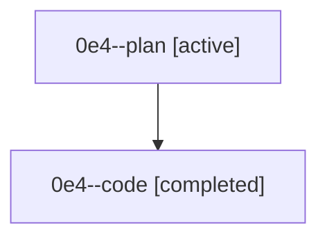

# Family: 0e4

[Agent Hoods](../README.md) / [bbugyi200](../users/bbugyi200/README.md) / [athena](../users/bbugyi200/machines/athena/README.md) / [0e4](../users/bbugyi200/machines/athena/hoods/0e4/README.md) / 0e4

Owner: `bbugyi200.athena` · Hood: `0e4` · Members: 2

## Lineage

The diagram is an optional enhancement; the ordered table below contains the same lineage in accessible text.

| Role | Agent | State | Model / provider | Timing | Commits | Prompt | Chat |
|---|---|---|---|---|---:|---|---|
| plan | 0e4--plan | active | opus / claude | 2026-08-26T11:54:47.935276+00:00 | 0 | [Prompt](../agents/bbugyi200.athena.0e4--plan/prompt.md) | [Chat](../agents/bbugyi200.athena.0e4--plan/chat.md) |
| code | 0e4--code | completed | sonnet / claude | 2026-08-26T12:19:01.839138+00:00 → 2026-08-26T12:44:17.526078+00:00 | [1](../agents/bbugyi200.athena.0e4--code/README.md#commits) | — | [Chat](../agents/bbugyi200.athena.0e4--code/chat.md) |

## Commits

| Role | Repo | Commit | Subject | Committed |
|---|---|---|---|---|
| code | sase | [`6ae021b`](https://github.com/sase-org/sase/commit/6ae021b2bb881b928c26cb8c8118ae7f1f1f13ee) | fix(xprompt): stop injecting the VCS workflow tag into #fork-injected history | 2026-08-26 08:41:12 EDT |
